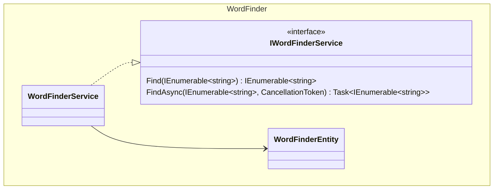

# Developer Challenge: Word Finder.


**Objetive:** The objective of this challenge is not necessarily just to solve the problem but to
evaluate your software development skills, code quality, analysis, creativity, and resourcefulness
as a potential future colleague. Please share the necessary artifacts you would provide to your
colleagues in a real -world professional setting to best evaluate your work.

<hr/>

Presented with a character matrix and a large stream of words, your task is to create a Class
that searches the matrix to look for the words from the word stream. Words may appear
horizontally, from left to right, or vertically, from top to bottom. In the example below, the word
stream has four words and the matrix contains only three of those words.

The search code must be implemented as a class with the following interface:

```csharp
public class WordFinder
{
    public WordFinder(IEnumerable<string> matrix) {
        ...
    }

    public IEnumerable<string> Find(IEnumerable<string>     wordstream)
    {
        ...
    }
}
```

The WordFinder constructor receives a set of strings which represents a character matrix. The
matrix size does not exceed 64x64, all strings contain the same number of characters. The
"Find" method should return the top 10 most repeated words from the word stream found in the
matrix. If no words are found, the "Find" method should return an empty set of strings. If any
word in the word stream is found more than once within the stream, the search results
should count it only once.

Due to the size of the word stream, the code should be implemented in a high performance
fashion both in terms of efficient algorithm and utilization of system resources. Where possible,
please include your analysis and evaluation.

## Accepptance criteria

- **Acceptance criteria 1:** The WordFinder receives a set of strings which represent a char matrix.
- **Acceptance criteria 2:** The matrix size does not exceed 64x64.
- **Acceptance criteria 3:** All the strings contain the same number of chars.
- **Acceptance criteria 4:** Find() must return  the top 10 must repeated words.
- **Acceptance criteria 5:** If no words are found, the find returns an empty set of strings.
- **Acceptance criteria 6:** If any word is found more than once, the search results should count it once.

## Solution description.

My proposed solution is a MAUI project utilizing .NET 8, the Community Toolkit, and a Domain-Driven Design architecture. It follows the MVVM (Model-View-ViewModel) architectural pattern and adheres to SOLID principles.



## Performance analysis.

- Added both synchronous and asynchronous methods to evaluate which are faster.
- Avoided using try-catch blocks extensively as they consume resources at runtime. (Instead, I use to use the Result pattern to handle controlled exceptions. Reserved try-catch for unexpected exceptions such as internet disconnection or API timeouts).
- I used for loops for iteration due to their lower performance cost compared to other looping constructs (foreach, high order functions loops).
- Implemented flags to control the flow and meet acceptance criteria, helping to avoid unnecessary procedures.

This provides a high-level overview of the performance evaluation.